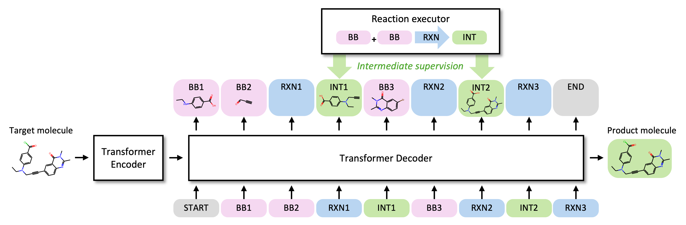

<h1 align="center">Rethinking Molecule Synthesizability with Chain-of-Reaction</h1>

This is the official code repository for the paper titled [Rethinking Molecule Synthesizability with Chain-of-Reaction](https://arxiv.org/abs/2509.16084).

<p align="center">
    
</p>

*Abstract:*
A well-known pitfall of molecular generative models is that they are not guaranteed to generate synthesizable molecules. There have been considerable attempts to address this problem, but given the exponentially large combinatorial space of synthesizable molecules, existing methods have shown limited coverage of the space and poor molecular optimization performance. To tackle these problems, we introduce ReaSyn, a generative framework for synthesizable projection where the model explores the neighborhood of given molecules in the synthesizable space by generating pathways that result in synthesizable analogs. To fully utilize the chemical knowledge contained in the synthetic pathways, we propose a novel perspective that views synthetic pathways akin to reasoning paths in large language models (LLMs). Specifically, inspired by chain-of-thought (CoT) reasoning in LLMs, we introduce the chain-of-reaction (CoR) notation that explicitly states reactants, reaction types, and intermediate products for each step in a pathway. With the CoR notation, ReaSyn can get dense supervision in every reaction step to explicitly learn chemical reaction rules during supervised training and perform step-by-step reasoning. In addition, to further enhance the reasoning capability of ReaSyn, we propose reinforcement learning (RL)-based finetuning and goal-directed test-time compute scaling tailored for synthesizable projection. ReaSyn achieves the highest reconstruction rate and pathway diversity in synthesizable molecule reconstruction and the highest optimization performance in synthesizable goal-directed molecular optimization, and significantly outperforms previous synthesizable projection methods in synthesizable hit expansion. These results highlight ReaSyn's superior ability to navigate combinatorially-large synthesizable chemical space.

Find the Model Card++ for ReaSyn [here](model_card/model_card.md).

## Installation

Run the following command to install dependencies:
```bash
conda env create -f env.yml
conda activate reasyn
```

## Data Preparation

### Reaction Teamplates
We use the 115 [reaction templates](https://github.com/wenhao-gao/synformer/tree/main/data/rxn_templates) used in [SynFormer](https://github.com/wenhao-gao/synformer). Place the data as `data/rxn_templates/comprehensive.txt`.

### Enamine Building Blocks
The building blocks used in the paper are from Enamine US Stock catalog, which are available upon request.<br>
After requesting the data from [Enamine](https://enamine.net/building-blocks/building-blocks-catalog), place the data as `data/building_blocks/building_blocks.txt`.<br>
Then, run the following command to preprocess the data:
```bash
python scripts/preprocess.py --model-config configs/train.yml
```

Alternatively, you can directly use preprocessed building block data.<br>
To resolve pickle path compatibility, first clone the [SynFormer](https://github.com/wenhao-gao/synformer) repository into the top-level directory for ReaSyn (`/ReaSyn`):
```bash
git clone https://github.com/wenhao-gao/synformer.git
cd synformer
pip install --no-deps -e .
pip install scikit-learn==1.6.0 # 1.6.0 is required to load fpindex.pkl
cd ..
```
Then, download the [preprocessed data](https://huggingface.co/whgao/synformer). Place `fpindex.pkl` and `matrix.pkl` in the folder `data/processed/comp_2048`.<br>
Then, run the following command:
```bash
python scripts/convert_processed_1.py
pip install scikit-learn==1.2.2 # 1.2.2 is required for hit expansion later
pip uninstall synformer         # optional; you may delete the synformer package
rm -rf synformer                # optional; you may delete the synformer folder
python scripts/convert_processed_2.py
```

### ZINC250k Building Blocks
For the synthesizable molecule reconstruction task on ZINC250k, we provide additional building blocks in `data/building_blocks/building_blocks_zinc250k.txt`.<br>
These are the molecules from ZINC250k that have more than 18 heavy atoms.<br>
Run the following command to preprocess the data:
```bash
python scripts/preprocess.py --model-config configs/preprocess_zinc250k.yml
```

## Training

We provide the [trained model checkpoint](https://catalog.ngc.nvidia.com/orgs/nvidia/teams/clara/resources/reasyn?version=1.0). Place `model.ckpt` in the `data/trained_model` directory.

### Supervised Learning
Run the following command to perform supervised training of ReaSyn:
```bash
torchrun --nnodes $NUM_NODES --nproc_per_node $SUBMIT_GPUS \
         --master_addr $MASTER_ADDR --master_port $MASTER_PORT --node_rank $NODE_RANK \
         scripts/train.py -n ${exp_name}
```
We used 2 nodes and 8 NVIDIA A100 GPUs/node. Training for 500k steps took 5~6 days.

### RL Finetuning
Run the following command to perform RL finetuning of ReaSyn:
```bash
torchrun --nproc_per_node ${num_gpus} scripts/finetune.py -n ${exp_name} -m ${model_path}
```
We used 4 NVIDIA A100 GPUs. Finetuning for 1k steps took 5 hours.

## Inference

### Synthesizable Molecule Reconstruction
Our paper evaluated ReaSyn on three test sets.<br>
For the Enamine and ChEMBL test sets, place `enamine_smiles_1k.txt` and `chembl_filtered_1k.txt` from [SynFormer](https://github.com/wenhao-gao/synformer/tree/main/data) in the `data` folder.<br>
For the ZINC250k test set, we provide `data/test_zinc250k.txt`.

Run the following command to conduct synthesizable molecule reconstruction:
```bash
python scripts/sample.py -m ${model_path} -i ${testset_path} -o ${output_path}
# python scripts/sample.py -m ${model_path} -i data/enamine_smiles_1k.txt -o results/enamine.txt
# python scripts/sample.py -m ${model_path} -i data/chembl_filtered_1k.txt -o results/chembl.txt
# python scripts/sample.py -m ${model_path} -i data/test_zinc250k.txt -o results/zinc250k.txt --add_bb_path data/processed/zinc250k_2048/fpindex.pkl
python scripts/eval_recon.py ${output_path}
```
We recommend using multiple GPUs for parallelized synthesizable molecule reconstruction.

### Synthesizable Goal-directed Optimization of TDC Oracles
Run the following command to conduct synthesizable goal-directed optimization of TDC oracles:
```bash
python scripts/optimize_tdc.py -m ${model_path} -o ${oracle} --use_regressor
```

### Synthesizable Hit Expansion
Run the following command to conduct synthesizable hit expansion:
```bash
python scripts/sample.py -m ${model_path} -i data/jnk3_hit.txt -o ${output_path} --reward_model jnk3 --exhaustiveness 128
python scripts/eval_hit.py ${output_path}
```

### (Optional) Filtering Pathways
We additionally provide the functionality to filter out generated pathways that lead to molecules that users want to avoid (e.g., toxic molecules). We provide an example catalog of toxic molecules in `data/mols_to_filter.txt`. Set `mols_to_filter` and `filter_sim` arguments to filter synthetic pathways for molecules whose Tanimoto similarity to `mols_to_filter` is greater than `filter_sim`.<br>
For example:
```bash
python scripts/sample.py -m ${model_path} -i ${testset_path} -o ${output_path} --mols_to_filter data/mols_to_filter.txt  --filter_sim ${filter_sim}
```

## License
Copyright @ 2025, NVIDIA Corporation. All rights reserved.<br>
The source code is made available under Apache-2.0.<br>
The model weights are made available under the [NVIDIA Open Model License](https://www.nvidia.com/en-us/agreements/enterprise-software/nvidia-open-model-license/).

## Citation
If you find this repository and our paper useful, we kindly request to cite our work.
```BibTex
@article{lee2025reasyn,
  title     = {Rethinking Molecule Synthesizability with Chain-of-Reaction},
  author    = {Lee, Seul and Kreis, Karsten and Veccham, Srimukh Prasad and Liu, Meng and Reidenbach, Danny and Paliwal, Saee and Nie, Weili and Vahdat, Arash},
  journal   = {arXiv},
  year      = {2025}
}
```
