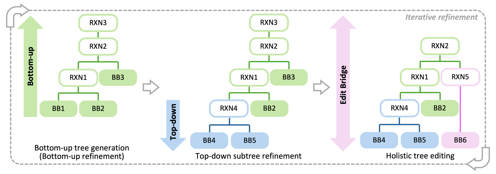
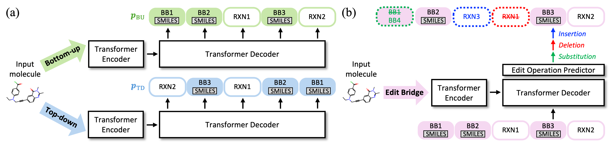

<h1 align="center">Exploring Sythesizable Chemical Space with Iterative Pathway Refinements</h1>

This is the official code repository for the paper titled [Exploring Sythesizable Chemical Space with Iterative Pathway Refinements](https://arxiv.org/abs/2509.16084).

<p align="center">
    
</p>

<p align="center">
    
</p>

*Abstract:*
A well-known pitfall of molecular generative models is that they are not guaranteed
to generate synthesizable molecules. Existing solutions for this problem often struggle
to effectively navigate exponentially large combinatorial space of synthesizable
molecules and suffer from poor coverage. To address this problem, we introduce
ReaSyn, an iterative generative pathway refinement framework that obtains synthesizable
analogs to input molecules by projecting them onto synthesizable space.
Specifically, we propose a simple synthetic pathway representation that allows for
generating pathways in both bottom-up and top-down traversal of synthetic trees.
We design ReaSyn so that both bottom-up and top-down pathways can be sampled
with a single unified autoregressive model. ReaSyn can thus iteratively refine subtrees
of generated synthetic trees in a bidirectional manner. Further, we introduce a
discrete flow model that refines the generated pathway at the entire pathway level
with edit operations: insertion, deletion, and substitution. The iterative refinement
cycle of (1) bottom-up decoding, (2) top-down decoding, and (3) holistic editing
constitutes a powerful pathway reasoning strategy, allowing the model to explore
the vast space of synthesizable molecules. Experimentally, ReaSyn achieves the
highest reconstruction rate and pathway diversity in synthesizable molecule reconstruction
and the highest optimization performance in synthesizable goal-directed
molecular optimization, and significantly outperforms previous synthesizable projection
methods in synthesizable hit expansion. These results highlight ReaSyn’s
superior ability to navigate combinatorially-large synthesizable chemical space.

Find the Model Card++ for ReaSyn [here](model_card/overview.md).

## Installation

Run the following command to install dependencies:
```bash
conda env create -f env.yml
conda activate reasyn
```

## Data Preparation

### Reaction Teamplates
We use the 115 [reaction templates](https://github.com/wenhao-gao/synformer/tree/main/data/rxn_templates) used in [SynFormer](https://github.com/wenhao-gao/synformer). Place the data as `data/rxn_templates/comprehensive.txt`.

### Enamine Building Blocks
The building blocks used in the paper are from Enamine US Stock catalog, which are available upon request.<br>
After requesting the data from [Enamine](https://enamine.net/building-blocks/building-blocks-catalog), place the data as `data/building_blocks/building_blocks.txt`.<br>
Then, run the following command to preprocess the data:
```bash
python scripts/preprocess.py --model-config configs/train.yml
```

Alternatively, you can directly use preprocessed building block data.<br>
To resolve pickle path compatibility, first clone the [SynFormer](https://github.com/wenhao-gao/synformer) repository into the top-level directory for ReaSyn (`/ReaSyn`):
```bash
git clone https://github.com/wenhao-gao/synformer.git
cd synformer
pip install --no-deps -e .
pip install scikit-learn==1.6.0 # 1.6.0 is required to load fpindex.pkl
cd ..
```
Then, download the [preprocessed data](https://huggingface.co/whgao/synformer). Place `fpindex.pkl` and `matrix.pkl` in the folder `data/processed/comp_2048`.<br>
Then, run the following command:
```bash
python scripts/convert_processed_1.py
pip install scikit-learn==1.2.2 # 1.2.2 is required for hit expansion later
pip uninstall synformer         # optional; you may delete the synformer package
rm -rf synformer                # optional; you may delete the synformer folder
python scripts/convert_processed_2.py
```

### ZINC250k Building Blocks
For the synthesizable molecule reconstruction task on ZINC250k, we provide additional building blocks in `data/building_blocks/building_blocks_zinc250k.txt`.<br>
These are the molecules from ZINC250k that have more than 18 heavy atoms.<br>
Run the following command to preprocess the data:
```bash
python scripts/preprocess.py --model-config configs/preprocess_zinc250k.yml
```

## Training

We provide the trained model checkpoint via [NGC](https://catalog.ngc.nvidia.com/orgs/nvidia/teams/clara/resources/reasyn) and HuggingFace ([AR](https://huggingface.co/nvidia/NV-ReaSyn-AR-166M-v2) and [EB](https://huggingface.co/nvidia/NV-ReaSyn-EB-174M-v2)). Place `nv-reasyn-ar-166m-v2.ckpt` and `nv-reasyn-eb-174m-v2.ckpt` in the `data/trained_model` directory.

### Autoregressive Model
Run the following command to train ReaSyn's autoregressive model for bottom-up and top-down pathway generation:
```bash
torchrun --nnodes $NUM_NODES --nproc_per_node $SUBMIT_GPUS \
         --master_addr $MASTER_ADDR --master_port $MASTER_PORT --node_rank $NODE_RANK \
         scripts/train.py -n ${exp_name} -c configs/train_ar.yml
```
We used 8 NVIDIA A100 GPUs. Training for 500k steps took 5~6 days.

### Edit Bridge Model

To train ReaSyn's Edit Bridge model, we generated the dataset of `(target molecule, AR-predicted pathway, true pathway)` triplets offline.<br>
Specifically, given a `(target molecule, true pathway)` pair, we first generated `AR-predicted pathway` with the trained AR model.<br>
Then, the aligned `(AR-predicted pathway, true pathway)` pair is obtained via the alignment process (Section B of the paper).<br>

Run the following command to prepare the training data for ReaSyn's Edit Bridge model:
```bash
python scripts/editflow_data_generate_x0.py -c configs/train_eb.yml -m ${pretrained_path} -d ${data_path}
python scripts/editflow_data_align.py -c configs/train_eb.yml -d ${data_path}
```
`pretrained_path` is the trained AR model path, e.g., `data/trained_model/nv-reasyn-ar-166m-v2.ckpt`.<br>
Running the first command creates a temporary folder `data_path_x0`. You may delete this folder after running the second command.<br>
Generating 10.5M data points with 120 NVIDIA A100 GPUs took ~3 days.

Run the following command to train ReaSyn's Edit Bridge model for holistic pathway editing:
```bash
torchrun --nnodes $NUM_NODES --nproc_per_node $SUBMIT_GPUS \
         --master_addr $MASTER_ADDR --master_port $MASTER_PORT --node_rank $NODE_RANK \
         scripts/train.py -n ${exp_name} -c configs/train_eb.yml -b 128 -d ${data_path}
```
We used 8 NVIDIA A100 GPUs. Training for 500k steps took ~5 days.

## Inference

### Synthesizable Molecule Reconstruction
Our paper evaluated ReaSyn on three test sets.<br>
For the Enamine and ChEMBL test sets, place `enamine_smiles_1k.txt` and `chembl_filtered_1k.txt` from [SynFormer](https://github.com/wenhao-gao/synformer/tree/main/data) in the `data` folder.<br>
For the ZINC250k test set, we provide `data/test_zinc250k.txt`.

Run the following command to conduct synthesizable molecule reconstruction:
```bash
python scripts/sample.py -m ${model_path} -i ${testset_path} -o ${output_path} --num_cycles ${num_cycles}
# python scripts/sample.py -m ${model_path} -i data/enamine_smiles_1k.txt -o results/enamine.txt --num_cycles 12
# python scripts/sample.py -m ${model_path} -i data/chembl_filtered_1k.txt -o results/chembl.txt --num_cycles 24
# python scripts/sample.py -m ${model_path} -i data/test_zinc250k.txt -o results/zinc250k.txt --num_cycles 16 --add_bb_path data/processed/zinc250k_2048/fpindex.pkl
python scripts/eval_recon.py ${output_path}
```
`model_path` is a comma-separated string of the AR and EB model paths, e.g., `data/trained_model/nv-reasyn-ar-166m-v2.ckpt,data/trained_model/nv-reasyn-eb-174b-v2.ckpt`.<br>
We recommend using multiple GPUs for parallelized synthesizable molecule reconstruction.

### Synthesizable Goal-directed Optimization of TDC Oracles
Run the following command to conduct synthesizable goal-directed optimization of TDC oracles:
```bash
python scripts/optimize_tdc.py -m ${model_path} -o ${oracle}
```
`model_path` is a comma-separated string of the AR and EB model paths, e.g., `data/trained_model/nv-reasyn-ar-166m-v2.ckpt,data/trained_model/nv-reasyn-eb-174b-v2.ckpt`.

### Synthesizable Hit Expansion
Run the following command to conduct synthesizable hit expansion:
```bash
python scripts/sample.py -m ${model_path} -i data/jnk3_hit.txt -o ${output_path} --search_width 12 --exhaustiveness 128 --num_cycles 12 --no_exact_break
python scripts/eval_hit.py ${output_path}
```
`model_path` is a comma-separated string of the AR and EB model paths, e.g., `data/trained_model/nv-reasyn-ar-166m-v2.ckpt,data/trained_model/nv-reasyn-eb-174b-v2.ckpt`.

### (Optional) Filtering Pathways
We additionally provide the functionality to filter out generated pathways that lead to molecules that users want to avoid (e.g., toxic molecules). We provide an example catalog of toxic molecules in `data/mols_to_filter.txt`. Set `mols_to_filter` and `filter_sim` arguments to filter synthetic pathways for molecules whose Tanimoto similarity to `mols_to_filter` is greater than `filter_sim`.<br>
For example:
```bash
python scripts/sample.py -m ${model_path} -i ${testset_path} -o ${output_path} --num_cycles ${num_cycles} --mols_to_filter data/mols_to_filter.txt --filter_sim ${filter_sim}
```

## License
Copyright @ 2025, NVIDIA Corporation. All rights reserved.<br>
The source code is made available under Apache-2.0.<br>
The model weights are made available under the [NVIDIA Open Model License](https://www.nvidia.com/en-us/agreements/enterprise-software/nvidia-open-model-license/).

## Contributing
This project is currently not accepting external contributions.

## Citation
If you find this repository and our paper useful, we kindly request to cite our work.
```BibTex
@article{lee2025reasyn,
  title     = {Exploring Sythesizable Chemical Space with Iterative Pathway Refinements},
  author    = {Lee, Seul and Kreis, Karsten and Veccham, Srimukh Prasad and Liu, Meng and Reidenbach, Danny and Paliwal, Saee and Nie, Weili and Vahdat, Arash},
  journal   = {arXiv},
  year      = {2025}
}
```
